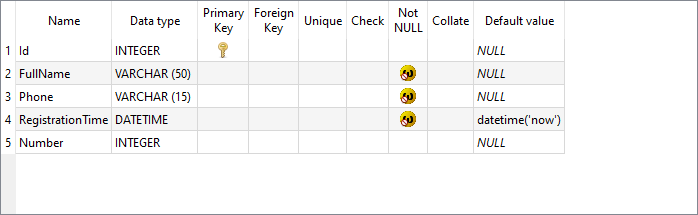

# Вставка данных из источника

**Аристарх Никодимович**: Как вы помните, с целью скорейшего запуска сбора данных мы приняли решение разворачивать отдельные базы данных в каждом магазине. Наконец-то наши коллеги из IT службы сделали всё необходимое для объединения всех наших магазинов в одну сеть - пришло время переходить на использование единой базы данных. Да, и не забудьте, что первая тысяча зарегистрировавшихся в каждом магазине должна будет получить свои приветственные бонусы.

Перед нами стоит амбициозная задача объединения нескольких БД в одну. Конечно же мы можем забрать данные из одной БД и построчно вставить их в другую, однако это решение будет неоптимальным и длительным. Например, следующий тест выполняется примерно за 10 секунд:

```cs
[Test]
public void Insert100Test()
{
    using (var db = new TutorialDataConnection())
    {
        for (var i = 0; i < 100; i++)
        {
            var customer = new Customer()
            {
                FullName = GenerateName(),
                Phone    = GeneratePhone()
            };

            var res = db.Insert(customer);
            Assert.AreNotEqual(0, res);
        }
    }
}
```

Здесь мы вставляем всего 100 записей, а 10 секунд, с точки зрения БД это практически вечность. Многие БД поддерживают возможность более эффективной вставки данных - `BULK INSERT` - специальный механизм, позволяющий вставлять тысячи записей за доли секунд. `linq2db` поддерживает данную возможность с использованием метода [BulkCopy](https://linq2db.github.io/api/LinqToDB.Data.DataConnectionExtensions.html#LinqToDB_Data_DataConnectionExtensions_BulkCopy__1_LinqToDB_Data_DataConnection_LinqToDB_Data_BulkCopyOptions_System_Collections_Generic_IEnumerable___0__). Примеры мы разберем чуть ниже, а пока...

## Подготовка

Для начала создадим новую БД - `central.sqlite`, и добавим в нее таблицу `Customer` с новым полем `Number` (далее будем звать эту базу "центральной"):



Затем расширим настройку строк соединений, так что бы у нас было две конфигурации:

```cs
var path1 = System.IO.Path.GetFullPath(@"..\..\..\..\DB\central.sqlite");
var path2 = System.IO.Path.GetFullPath(@"..\..\..\..\DB\database.sqlite");

// Зададим конфигурацию
DataConnection.AddOrSetConfiguration("*",   $"Data Source={path1};", ProviderName.SQLiteClassic);
DataConnection.AddOrSetConfiguration("low", $"Data Source={path2};", ProviderName.SQLiteClassic);

// Зададим конфигурацию по умолчанию
DataConnection.DefaultConfiguration = "*";
```

Теперь по умолчанию мы будем обращаться к базе `central.sqlite` а с использованием конфигурации `low` сможем обращаться к `database.sqlite` которую с этих пор будем считать базой с некоторого магазина - далее будем ее звать "нижней".

И наконец изменим наш `Model.tt` так, что бы модель генерировалась с `central.sqlite`:

```cs
LoadSQLiteMetadata(this.Host.ResolvePath(@"..\..\DB\"), "central.sqlite");
```

После чего перегенерируем модель.

## Вставка большого массива данных

Итак, прешел черед разобраться с [BulkCopy](https://linq2db.github.io/api/LinqToDB.Data.DataConnectionExtensions.html#LinqToDB_Data_DataConnectionExtensions_BulkCopy__1_LinqToDB_Data_DataConnection_LinqToDB_Data_BulkCopyOptions_System_Collections_Generic_IEnumerable___0__).

```cs
[Test]
public void BulkCopyTest()
{
    var data = new DataContext("low")
        .GetTable<Customer>()
        .Select(_ => new Customer()
        {
            Id               = _.Id,
            FullName         = _.FullName,
            Phone            = _.Phone,
            RegistrationTime = _.RegistrationTime,
            Number           = _.Id
        });

    using (var db = new TutorialDataConnection())
    {
        db.BulkCopy(data);
    }
}
```

Для начала отмечу, что время выполнения этого кода всего порядка 1 секунды, всего же было вставлено более 500 записей.

Теперь разберем прочие интересные моменты данного теста.

В первую очередь мы с вами забираем данные из "нижней" базы, при чем, как вы помните мы **не добавляли** в ней в таблицу `Customer` колонку `Number`, в случае если бы мы забирали данные следующим кодом:

```cs
    var data = new DataContext("low")
        .GetTable<Customer>()
        .ToArray();
```

Мы бы получили исключение при выполнении SQL запроса, с сообщением о том, что колонка `Number` отсутствует в таблице `Customer`. В примере же мы **явно** указываем какие колонки из таблицы забирать и в какие свойства класса `Customer` их следует мапить, ввиду того, что мы не выбираем колонку `Number` она отсутствует в SQL запросе и, как следствие, запрос успешно выполняется.

Следующий интересный момент - SQLite **не поддерживает** `BULK INSERT`, но всё успешно работает и данные в таблицу вставляются, причем время вставки значительно ниже построчной. Посмотрим на выполненный SQL запрос:

```sql
-- * SQLite.Classic SQLite
INSERT INTO [Customer]
(
    [FullName],
    [Phone],
    [Number]
)
VALUES
('Кира Толкачёва','+7 679 961 84 27',1),
('Василиса Рождественская','+7 277 429 52 90',2),
('Юнона Бебчук','+7 245 640 57 26',3),
('Юнона Бебчук','+7 245 640 57 26',4),
('Нина Косицкая','+7 929 335 17 9',5),
('Нина Косицкая','+7 929 335 17 9',6),
('Якуб Голумбовский','+7 137 375 71 79',7),
-- остальные строки пропущены
```

SQLite поддерживает возможность вставки нескольких записей методом перечисления их в `VALUES` и `linq2db` использует эту возможность для "мимикрии" под `BULK INSERT`.

И последний, но от того не менее важный момент, обратите внимание, что мы явно **не метериализуем** запрос получения данных из "нижней" базы (т.е. не используем `ToArray()`, `ToList()`... etc). Дело в том, что `IQueryable<T>` реализует `IEnumerable<T>`, который принимает `BulkCopy`. Таким образом материализация запроса происходит "постепенно", по факту того как `BulkCopy` вычитывает данные из запроса, вставляет их в базу и затем вычитывает следующую порцию. Здесь мы выигрываем в двух вещах:

* Память - `BulkCopy` вычитывает данные порционно, вставляет их в БД и "забывает" про них. На материализованные объекты более нет ссылок и они могут быть освобождены сборщиком мусора.
* Скорость - при больших объемах данных мы можем начать получать первые записи выборки до фактического завершения выполнения запроса, можно сказать, что `BulkCopy` будет вставлять данные по мере получения их из запроса, а не после того как запрос будет уже полностью выполнен и материализован.

Эти два момента позволяют перегонять данные между двумя базами миллионами записей с минимальной нагрузкой как на память, так и на процессор.

**Важно:** к сожалению, так нельзя делать в рамках одного соединения с БД. Дело в том, что одно соединение может поддерживать только один активный (выполняемый) запрос в единицу времени, по сути это та же ситуация, которую мы разбирали в разделе [многопоточность](../dataconnection.md#многопоточность).

Итак, мы успешно собрали данные с "нижних" баз в центральную. Исходный код к разделу доступен [здесь](https://github.com/linq2db/tutorial.sources/tree/bulk_copy).

## Не всё так гладко

**Аристарх Никодимович**: Формирование центральной базы успешно завершено, однако, мы обнаружили, что некоторые наши покупатели регистрировались в нескольких магазинах, теперь у нас в базе есть дублирующиеся записи. Нужно привести данные в порядок, убрав дублирующиеся записи.

## Вставка данных из выборки

Многие БД поддерживают возможность вставки данных из результата выборки, схематично это выглядит следующим образом:

```sql
INSERT INTO [Table] ([Field1], [Field2])
SELECT [Field1], [Field2] FROM [OtherTable]

```

`linq2db` конечно же поддерживает данный сценарий. Ниже мы рассмотрим как это можно провернуть, пока же распишем примерный сценарий действий:

1. Выберем уникальные записи из таблицы `Customer`.
2. Вставим их во временную таблицу.
3. Удалим данные из таблицы `Customer`.
4. Перенесем данные из временной таблицы в `Customer`.

Данный сценарий, конечно, не является оптимальным решением задачи и позже мы вернемся к этой задаче, и решим её несколькими другими способами.

### Создание временной таблицы

Для начала объявим класс, описывающий нашу временную таблицу:

```cs
public class TmpCustomer
{
    [Column(Length = 50)]
    public string TmpFullName { get; set; }

    [Column(Length = 15)]
    public string TmpPhone { get; set; }

    public DateTime TmpRegistrationTime { get; set; }

    public long? TmpNumber { get; set; }
}
```

По сути он повторяет таблицу `Customer` за исключением поля `Id`, которое нам не нужно. Обратите внимание на использование параметра `Length` атрибута `Column` он нужен для того, что бы выставить правильную длину колонок для временной таблицы. Префикс `Tmp` дан свойствам что бы позже было легче читать запросы. Создать таблицу можно следующим выражением:

```cs
var tmpTable = db.CreateTempTable<TmpCustomer>();
```

При этом будет выполнен следующий SQL запрос:

```sql
CREATE TABLE [TmpCustomer]
(
    [TmpFullName]         NVarChar(50)     NULL,
    [TmpPhone]            NVarChar(15)     NULL,
    [TmpRegistrationTime] DateTime2    NOT NULL,
    [TmpNumber]           BigInt           NULL
)
```

После завершения всех процедур нам нужно будет удалить нашу таблицу (C# и SQL код приведены ниже):

```cs
tmpTable.Drop();
```

```sql
DROP TABLE [TmpCustomer]
```

### Выборка уникальных записей

Это всегда достаточно нетривиальный момент, для начала нужно ответить на два вопроса:

1. Как идентифицировать уникальность записи.
2. Какие значения выбрать из каких строк.

В нашем случае всё достаточно просто - идентифицируем запись по номеру телефона, а значения порядкового номера, даты регистрации и имени - выберем просто минимальными (SQL запрос будет приведен ниже):

```cs
var uniqueQry = from c in db.Customers
                group c by c.Phone into grouped
                select new
                {
                    Phone = grouped.Key,
                    Number = grouped.Min(_ => _.Number),
                    RegistrationTime = grouped.Min(_ => _.RegistrationTime),
                    FullName = grouped.Min(_ => _.FullName)
                };
```

### Вставка данных

Здесь `linq2db` предоставляет нам несколько вариантов, начнем с вставки данных из результата выборки:

```cs
uniqueQry // запрос, построенный нами выше
    .Into(tmpTable) // Into - указывает что результат должен быть вставлен в таблицу, переданную в качестве аргумента
        .Value(_ => _.TmpFullName, _ => _.FullName) // Value позволяют соотнести поля источника и таблицы назначения
        .Value(_ => _.TmpNumber, _ => _.Number)
        .Value(_ => _.TmpRegistrationTime, _ => _.RegistrationTime)
        .Value(_ => _.TmpPhone, _ => _.Phone)
    .Insert(); // Insert - выполняет собственно запрос
```

Ну и SQL:

```sql
INSERT INTO [TmpCustomer]
(
    [TmpFullName],
    [TmpNumber],
    [TmpRegistrationTime],
    [TmpPhone]
)
SELECT
    Min([t1].[FullName]),
    Min([t1].[Number]),
    Min([t1].[RegistrationTime]),
    [t1].[Phone]
FROM
    [Customer] [t1]
GROUP BY
    [t1].[Phone]
```

Следующим этапом мы зачищаем таблицу `Customer`:

```cs
db.Customers.Delete();
```

```sql
DELETE FROM
    [Customer]
```

Ну и наконец вставляем обратно наши уникальные записи:

```cs
tmpTable // временная таблица
    .Insert(db.Customers, _ => new Customer()  // Insert позволяет указать куда и что вставить
    {
        FullName = _.TmpFullName,
        Number = _.TmpNumber,
        Phone = _.TmpPhone,
        RegistrationTime = _.TmpRegistrationTime
    });
```

```sql
INSERT INTO [Customer]
(
    [FullName],
    [Number],
    [Phone],
    [RegistrationTime]
)
SELECT
    [t1].[TmpFullName],
    [t1].[TmpNumber],
    [t1].[TmpPhone],
    [t1].[TmpRegistrationTime]
FROM
    [TmpCustomer] [t1]
```

Исходный код доступен [здесь](https://github.com/linq2db/tutorial.sources/tree/insert_from).

[Далее](test.md)
