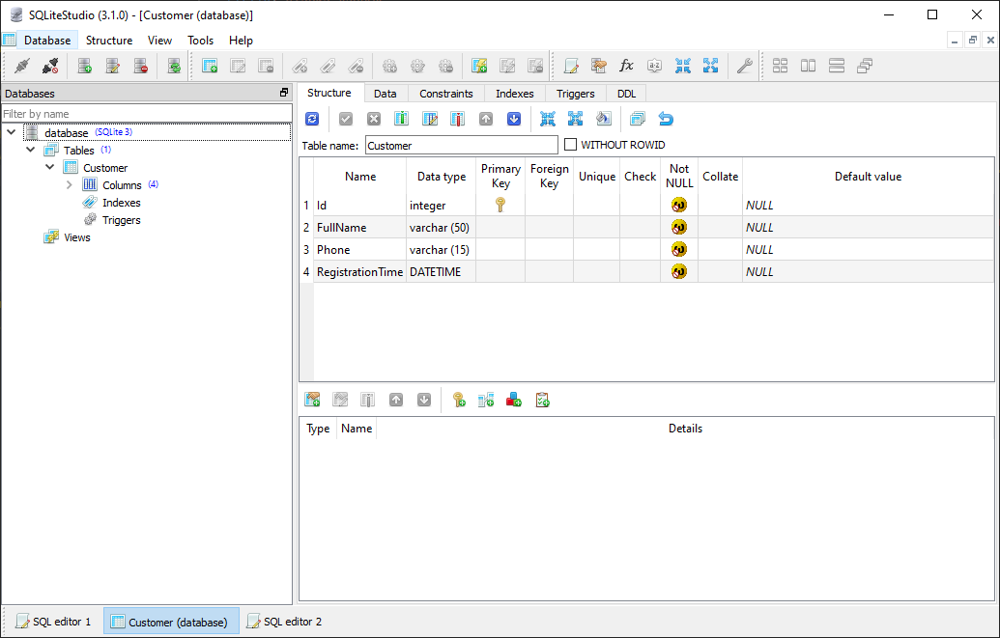

# Вставка данных

## Первое задание от Аристарха Никодимовича

Необходимо в кратчайшие сроки собрать базу данных покупателей сети Ромашка. С этой целью в каждом магазине покупателям предлагают заполнить анкету, где оставить своё полное имя и номер телефона. Наши коллеги уже во всю пишут интерфейсную часть приложения, а нам необходимо подготовить БД для хранения данных. Так же необходимо зафиксировать дату регистрации посетителя.

С целью ускорения процесса процесса решено временно отказаться от использования централизованной системы и вводить данные параллельно во всех магазинах.

Что ж, задача не сложная - нам нужна таблица `Customer` с тремя обязательными (`NOT NULL`) полями:

* `FullName` - полное имя
* `Phone` - номер телефона
* `RegistrationTime` - дата и время регистрации
* `Id` - немного подумав мы решили сразу добавить в таблицу автоинкрементный ключ, обычная практика.

Создадим данную таблицу в нашей тестовой базе используя `SQLiteStudio`:



После исправления базы мы должны [перегенерировать модель](../t4create.md).

## Вставка целых объектов

Вставка данных осуществляется методами `Insert`. `linq2db` предоставляет обширный список методов для вставки данных, перекрывающий практически все возможности SQL. Самым простым является вставка целого объекта со всеми его полями:

* [Insert<T>(this IDataContext dataContext, T obj, string tableName = null, string databaseName = null, string schemaName = null)](https://linq2db.github.io/api/LinqToDB.DataExtensions.html#LinqToDB_DataExtensions_Insert__1_LinqToDB_IDataContext___0_System_String_System_String_System_String_). Метод получает следующие параметры:
  * `dataContext` - соединение с БД.
  * `obj` - объект для вставки.
  * `tableName`, `databaseName`, `schemaName` - имя таблицы, базы данных и схемы, данные пераметры передаются если вы хотите вставить данные в таблицу с другим названием.
* [InsertAsync<T>(this IDataContext dataContext, T obj, string tableName = null, string databaseName = null, string schemaName = null, CancellationToken token = default(CancellationToken))](https://linq2db.github.io/api/LinqToDB.DataExtensions.html#LinqToDB_DataExtensions_InsertAsync__1_LinqToDB_IDataContext___0_System_String_System_String_System_String_System_Threading_CancellationToken_) - асинхронная перегрузка данного метода.

Оба этих метода возвращают число обработанных строк.

Теперь мы должны предоставить нашим коллегам пример того, как им вставлять данные в базу:

```cs
[Test]
public void InsertTest()
{
    using (var db = new TutorialDataConnection())
    {
        var customer = new Customer()
        {
            FullName = GenerateName(),
            Phone = GeneratePhone(),
            RegistrationTime = DateTime.Now
        };

        var res = db.Insert(customer);
        Assert.AreNotEqual(0, res);
    }
}
```

Посмотрим так же на выполненный SQL запрос:

```sql
-- * SQLite.Classic SQLite
DECLARE @FullName NVarChar(14) -- String
SET     @FullName = 'Кира Толкачёва'
DECLARE @Phone NVarChar(16) -- String
SET     @Phone = '+7 679 961 84 27'
DECLARE @RegistrationTime  -- DateTime
SET     @RegistrationTime = '2019-10-16 23:14:29.722'

INSERT INTO [Customer]
(
    [FullName],
    [Phone],
    [RegistrationTime]
)
VALUES
(
    @FullName,
    @Phone,
    @RegistrationTime
)
```

Рассмотрим так же пример асинхронного вызова:

```cs
[Test]
public async Task InsertTestAsync()
{
    using (var db = new TutorialDataConnection())
    {
        var customer = new Customer()
        {
            FullName = GenerateName(),
            Phone = GeneratePhone(),
            RegistrationTime = DateTime.Now
        };

        var res = await db.InsertAsync(customer);
        Assert.AreNotEqual(0, res);
    }
}
```

**Важно**: в прочих примерах мы будем рассматривать только синхронные вызовы, т.к. все они имеют своих асинхронных "побратимов" с постфиксом `Async`.

Выполненный в данном случае SQL запрос идентичен предыдущему, можете убедится в этом сами. Исходные коды доступны [здесь](https://github.com/linq2db/tutorial.sources/tree/insert):

* `InsertTests.InsertTest()`
* `InsertTests.InsertAsyncTest()`

## Вставка с получением идентификатора

**Аристарх Никодимович**: Отлично! Мы приступили к сбору информации о наших покупателях. Однако, люди неохотно оставляют свои данные, конечно же они устали от спам рассылок, но мы же не спамеры! Что бы продемонстрировать свои благие цели мы пообещали первой тысяче зарегистрировавшихся в каждом магазине начислить дополнительные бонусные баллы! А значит люди должны знать свой порядковый номер, скорее внесите изменение в программу что бы мы могли им сообщить, что они попали в первую тысячу!

Итак, пора снова за работу. Наша прозорливость оказала нам добрую услугу, конечно, идентификатор записи, не для того вводился, но всё же это автоинкрементное поле, а значит можно его считать и порядковым номером. Приятно, когда что то получаешь бонусом.

Большинство БД поддерживают автоинкрементные идентификаторы, генерируемые на стороне БД, которые в дальнейшем используются для обновления записей, обеспечения ссылочной целостности, идентификации записи и т.д. Очень часто приложению необходимо знать этот идентификатор после вставки. Но как, если он генерируется самой БД? Конечно можно попробовать сделать выборку из базы и найти максимальный номер, раз уж он постоянно растет, но такая реализация ведет к дополнительным накладным расходам с одной стороны и не безопасна с другой - ведь добавление данных может происходить параллельно с нескольких рабочих мест, и как следствие мы можем получить идентификатор другой записи. Конечно же, разработчики БД позаботились о нас, и предоставили нам возможность после вставки получить данный идентификатор. К сожалению, единого стандарта здесь нет, и в каждой БД эта операция реализована по своему. Однако, `linq2db` выручает нас и здесь, представляя "семейство" методов `InsertWithIdentity`. Здесь следует оговориться, что в некоторых БД поддерживаются не только целочисленные генерируемые идентификаторы, поэтому метод `InsertWithIdentity` возвращает тип `object`. С другой стороны в большинстве случаев это всё же числовой идентификатор, поэтому есть "перегрузки" данного метода, возвращающие `Int32`, `Int64` и `decimal`.

Рассмотрим сигнатуры данного семейства методов (все они имеют так же асинхронные реализации, которые мы здесь не будем приводить). Назначение параметров аналогично методам `Insert`, поэтому мы так же их опустим:

* [object InsertWithIdentity<T>(this IDataContext dataContext, T obj, string tableName = null, string databaseName = null, string schemaName = null)](https://linq2db.github.io/api/LinqToDB.DataExtensions.html#LinqToDB_DataExtensions_InsertWithIdentity__1_LinqToDB_IDataContext___0_System_String_System_String_System_String_)
* [int InsertWithInt32Identity<T>(this IDataContext dataContext, T obj, string tableName = null, string databaseName = null, string schemaName = null)](https://linq2db.github.io/api/LinqToDB.DataExtensions.html#LinqToDB_DataExtensions_InsertWithInt32Identity__1_LinqToDB_IDataContext___0_System_String_System_String_System_String_)
* [long InsertWithInt64Identity<T>(this IDataContext dataContext, T obj, string tableName = null, string databaseName = null, string schemaName = null)](https://linq2db.github.io/api/LinqToDB.DataExtensions.html#LinqToDB_DataExtensions_InsertWithInt64Identity__1_LinqToDB_IDataContext___0_System_String_System_String_System_String_)
* [decimal InsertWithDecimalIdentity<T>(this IDataContext dataContext, T obj, string tableName = null, string databaseName = null, string schemaName = null)](https://linq2db.github.io/api/LinqToDB.DataExtensions.html#LinqToDB_DataExtensions_InsertWithDecimalIdentity__1_LinqToDB_IDataContext___0_System_String_System_String_System_String_)

Рассмотрим пример кода:

```cs
[Test]
public void InsertWithInt64IdentityTest()
{
    using (var db = new TutorialDataConnection())
    {
        var customer = new Customer()
        {
            FullName = GenerateName(),
            Phone = GeneratePhone(),
            RegistrationTime = DateTime.Now
        };

        var id1 = db.InsertWithInt64Identity(customer);
        Assert.AreNotEqual(0, id1);

        var id2 = db.InsertWithInt64Identity(customer);
        Assert.AreNotEqual(0, id2);

        Assert.AreEqual(id1 + 1, id2);
    }
}
```

А так же выполненный SQL запрос:

```sql
-- * SQLite.Classic SQLite
DECLARE @FullName NVarChar(12) -- String
SET     @FullName = 'Юнона Бебчук'
DECLARE @Phone NVarChar(16) -- String
SET     @Phone = '+7 245 640 57 26'
DECLARE @RegistrationTime  -- DateTime
SET     @RegistrationTime = '2019-10-17 00:00:54.031'

INSERT INTO [Customer]
(
    [FullName],
    [Phone],
    [RegistrationTime]
)
VALUES
(
    @FullName,
    @Phone,
    @RegistrationTime
)

-- * SQLite.Classic SQLite
SELECT last_insert_rowid()
```

Последняя строчка - вызов метода, возвращающего последний идентификатор, предоставляемого SQLite, у каждой БД этот метод, повторимся, свой, и `linq2db` выберет необходимый, в зависимости от поставщика данных.

Исходный код доступен [здесь](https://github.com/linq2db/tutorial.sources/tree/InsertWithInt64Identity):

* `InsertTests.InsertWithInt64IdentityTest()`

[Далее](values.md)
