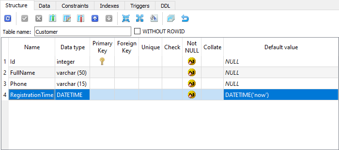
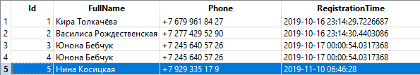

# Вставка данных с перечислением полей

**Аристарх Никодимович**: Дела идут лучше некуда, мы привлекли множество людей, желающих столько что выстраиваются очереди, а заставлять людей ждать - недопустимо. Нам необходимо уменьшить время ввода данных, мы проанализировали ситуацию и сформировали ряд решений, пока ваши коллеги делают более удобные интерфейсы ваша задача - автоматически заполнять время регистрации.

Конечно, мы могли бы просто заполнить время регистрации автоматически, но зачем работать самим, когда можно заставить работать БД - большинство БД поддерживают возможность автоматической генерации значений по умолчанию для полей таблиц. Изменим нашу БД так, что бы время регистрации заполнялось само при вставке:



В такой конфигурации в случае, если в выражение `INSERT` не будет передано поле `RegistrationTime` БД сама подставит текущее время, в ином случае будет вставлено переданное значение. Другими словами нам необходим SQL запрос следующего вида:

```sql
INSERT INTO [Customer]
(
    [FullName],
    [Phone]
)
VALUES
(
    @FullName,
    @Phone
)
```

Однако, в использованном нами методе `Insert` нет возможности управлять полями явно. Рассмотрим два варианта решения данной задачи:

* С использованием маппинга
* С явным перечислением полей

## Использование мапинга

Как мы рассматривали ранее у атрибута [Column](https://linq2db.github.io/api/LinqToDB.Mapping.ColumnAttribute.html) есть свойство [SkipOnInsert](https://linq2db.github.io/api/LinqToDB.Mapping.ColumnAttribute.html#LinqToDB_Mapping_ColumnAttribute_SkipOnInsert), если мы выставим его в `true` для свойства `RegistrationTime` то методы `Insert` & `InsertWithIdentity` будут генерировать SQL без данного поля.

Для назначения данного атрибута изменим `Model.tt` следующим образом:

```cs
NamespaceName   = "LinqToDB.Tutorial.Models";
DataContextName = "TutorialDataConnection";
BaseEntityClass = "IId";

LoadSQLiteMetadata(this.Host.ResolvePath(@"..\..\DB\"), "database.sqlite");

// Зададим свойство Column.SkipOnInsert для Customer.RegistrationTime
GetColumn("Customer", "RegistrationTime").SkipOnInsert = true;

GenerateModel();
```

Сгенерированный код для класса `Customer` будет следующим:

```cs
[Table("Customer")]
public partial class Customer : IId
{
    [PrimaryKey,                Identity] public long     Id               { get; set; }
    [Column,                    NotNull ] public string   FullName         { get; set; }
    [Column,                    NotNull ] public string   Phone            { get; set; }
    [Column(SkipOnInsert=true), NotNull ] public DateTime RegistrationTime { get; set; }
}

```

Теперь если мы выполним любой из ранее написанных тестов для вставки данных мы увидим что `RegistrationTime` исключен из запроса `INSERT`:

```sql
-- * SQLite.Classic SQLite
DECLARE @FullName NVarChar(13) -- String
SET     @FullName = 'Нина Косицкая'
DECLARE @Phone NVarChar(15) -- String
SET     @Phone = '+7 929 335 17 9'

INSERT INTO [Customer]
(
    [FullName],
    [Phone]
)
VALUES
(
    @FullName,
    @Phone
)
```

В то же время в самой базе данное значене заполнено:



## Перечисление полей при вставке

Мапинг хотя и удобное, но не универсальное решение, в конце концов может потребоваться в некоторых случаях время регистрации и заполнять. `linq2db` поддерживает возможность явно перечислять поля для вставки, а главное - задавать **выражения** для их значений.

Для начала рассмотрим пример, а затем разберем его:

```cs
[Test]
public void InsertValuesTest()
{
    using (var db = new TutorialDataConnection())
    {
        var res = db.Customers
            .Value(_ => _.FullName,       GenerateName())
            .Value(_ => _.Phone,    () => GeneratePhone())
            .InsertWithInt64Identity();

        Assert.AreNotEqual(0, res);
    }
}
```

Во первых методы расширения (extension methods) [Value](https://linq2db.github.io/api/LinqToDB.LinqExtensions.html#LinqToDB_LinqExtensions_Value__2_LinqToDB_ITable___0__System_Linq_Expressions_Expression_System_Func___0___1_____1_) позволяют перечислить перечень полей для вставки. Методы принимают два аргумента:

* Первый - это лямда, указывающее для какой колонки таблицы мы будем задавать значение
* Второй - это либо значение для колонки (как в случае с `FullName`), либо **выражение** в виде лямбды, как в случае с `Phone`. И это очень важный момент - т.к. `linq2db` постарается разобрать лямбду и привести ее к SQL выражению (пример мы рассмотрим чуть ниже).

После перечисления полей необходимо вызвать либо [Insert](https://linq2db.github.io/api/LinqToDB.LinqExtensions.html#LinqToDB_LinqExtensions_Insert__1_LinqToDB_Linq_IValueInsertable___0__) либо [InsertWithIdentity](https://linq2db.github.io/api/LinqToDB.LinqExtensions.html#LinqToDB_LinqExtensions_InsertWithDecimalIdentity__1_LinqToDB_ITable___0__System_Linq_Expressions_Expression_System_Func___0___) (вызов этих методов приводит к выполнению запроса).

Теперь рассмотрим полученный SQL:

```sql
-- * SQLite.Classic SQLite
DECLARE @p1 NVarChar(16) -- String
SET     @p1 = '+7 856 091 97 31'

INSERT INTO [Customer]
(
    [FullName],
    [Phone]
)
VALUES
(
    'Ариадна Диденкова',
    @p1
)
```

Обратим внимание на то какие выражения получились для колонок:

* `FullName` - для него подставлено явное значение, которое мы передали в метод `Value`
* `Phone` - здесь в `Value` была передана лямбда, поскольку `linq2db` не смогло преобразовать вызов метода `GeneratePhone()` в SQL запрос, метод был вызван на стороне клиента, а его результат передан в качестве параметра в запрос.

Рассмотрим более подробно использование выражений в качестве значений для `Value`:

```cs
[Test]
public void InsertValuesExpressionTest()
{
    using (var db = new TutorialDataConnection())
    {
        var qry = db.Customers
            .Value(_ => _.FullName,    GenerateName())
            .Value(_ => _.Phone, () => GeneratePhone());

        qry = qry
            .Value(_ => _.RegistrationTime, () => Sql.CurrentTimestamp);

        var res = qry.InsertWithInt64Identity();

        Assert.AreNotEqual(0, res);
    }
}
```

Здесь для `RegistrationTime` мы передаем [Sql.CurrentTimestamp](https://linq2db.github.io/api/LinqToDB.Sql.html#LinqToDB_Sql_CurrentTimestamp) ([Sql](https://linq2db.github.io/api/LinqToDB.Sql.html) - статический класс с множеством методов, которые могут быть преобразованы в SQL выражение), и в результате получаем следующий запрос:

```sql
-- * SQLite.Classic SQLite
DECLARE @p1 NVarChar(16) -- String
SET     @p1 = '+7 466 152 79 28'

INSERT INTO [Customer]
(
    [FullName],
    [Phone],
    [RegistrationTime]
)
VALUES
(
    'Эмма Лесничая',
    @p1,
    CURRENT_TIMESTAMP
)
```

Как мы видим для заполнения `[RegistrationTime]` используется SQL выражение `CURRENT_TIMESTAMP`, а не параметр.

А так же в данном коде мы демонстрируем Query Composition - прием, позволяющий "строить" запрос, опционально добавляя в него новые выражения. Допустим, если бы нам сказали, что время регистрации нужно заполнять только в том случае, если оно не передаано, мы могли бы решить это следующим образом:

```cs
public static DateTime?[] RegistrationTimes = { null as DateTime?, DateTime.Now };

[Test]
public void InsertValuesQueryCompositionTest([ValueSource(nameof(RegistrationTimes))] DateTime? registarionTime)
{
    using (var db = new TutorialDataConnection())
    {
        var qry = db.Customers
            .Value(_ => _.FullName,    GenerateName())
            .Value(_ => _.Phone, () => GeneratePhone());

        if (registarionTime.HasValue)
            qry = qry
                .Value(_ => _.RegistrationTime, () => Sql.CurrentTimestamp);

        var res = qry.InsertWithInt64Identity();

        Assert.AreNotEqual(0, res);
    }
}
```

И последний момент на который мы обратим внимание - флаг `SkipOnInsert` не действует в случае явного указания колонки методом `Value`.

При всех своих достоинствах использование метода `Value` может быть слегка громоздким более лаконичным может быть использование методов [Insert](https://linq2db.github.io/api/LinqToDB.LinqExtensions.html#LinqToDB_LinqExtensions_Insert__1_LinqToDB_ITable___0__System_Linq_Expressions_Expression_System_Func___0___) и [InsertWithIdentity](https://linq2db.github.io/api/LinqToDB.LinqExtensions.html#LinqToDB_LinqExtensions_InsertWithDecimalIdentity__1_LinqToDB_ITable___0__System_Linq_Expressions_Expression_System_Func___0___), принимающих лямбду с инициализацией полей:

```cs
[Test]
public void InsertNewTest()
{
    using (var db = new TutorialDataConnection())
    {
        var res = db.Customers
            .InsertWithInt64Identity(() => new Customer()
            {
                FullName         = GenerateName(),
                Phone            = GeneratePhone(),
                RegistrationTime = Sql.CurrentTimestamp
            });

        Assert.AreNotEqual(0, res);
    }
}
```

В данном случае будут вставлены только перечисленные в инициализации колонки, а так же приемуществом данного метода как и в случае с `Value` является возможность использовать выражения.

Код к данному разделу доступен в ветке [insert_values](https://github.com/linq2db/tutorial.sources/tree/insert_values).

[Далее, вставка из источника](from.md)
