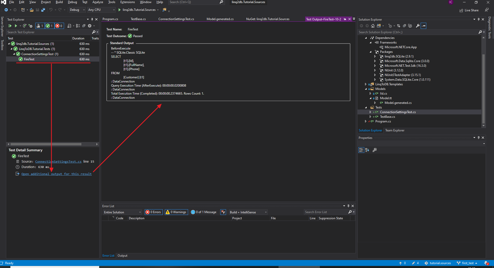

# Запросы

После того, как вы научились создавать модель данных и настраивать соединение вы можете приступить к выполнению запросов к БД. [SQL](https://ru.wikipedia.org/wiki/SQL) предлагает нам четыре основных группы запросов, при помощи которых осуществляются манипуляции с данными:

* `INSERT` - запросы для вставки (добавления) данных.
* `SELECT` - запросы для выборки данных.
* `UPDATE` - запросы для обновления данных.
* `DELETE` - запросы для удаления данных.

`linq2db` - практически полностью поддерживает все возможности, предоставляемые данными запросами с учетом специфики различных диалектов SQL у разных баз данных.

Ряд БД так же поддерживают расширения стандартного SQL, так же поддерживаемые `linq2db`:

* [Аналитические (оконные) функции](https://linq2db.github.io/articles/sql/Window-Functions-%28Analytic-Functions%29.html)
* [MERGE](https://linq2db.github.io/articles/sql/merge/Merge-API.html)
* [Common table expressions (CTE)](https://linq2db.github.io/articles/sql/CTE.html)

В рамках данного курса в первую очередь мы будем рассматривать с вами первую группу запросов, как наиболее востребованные и часто используемые.

Для максимально эффективного использования всех возможностей `linq2db` в перспективе вам потребуются хорошие знания SQL, если вы ощущаете нехватку знаний в этой области рекомендую вам пройти курс на [http://www.sql-ex.ru](http://www.sql-ex.ru).

В рамках данного курса мы рассмотрим основные возможности SQL и использование их при помощи `linq2db`.

## Структура курса

В дальнейшем все части курса будут состоять из двух основных частей:

1. Теоретического описания возможностей SQL и `linq2db`.
2. Практического применения данных знаний.

В ходе практической части мы познакомимся с Аристархом Никодимовичем - руководителем отдела маркетинга федеральной торговой сети "Ромашка". Аристарх Никодимович, человек педантичный и преданный своему делу - продвижению торговой сети на федеральном рынке. Аристарх Никодимович очень трепетно относится к покупателем торговой сети считая их практически членами своей семьи, и стремиться обеспечить для них максимальный комфорт и лояльность со стороны компании. Поэтому он обратился к нам, за разработкой бонусной системы, которая позволит ему ближе познакомиться со своими покупателями, а им (покупателям) получать различного рода приятности. На наше счастье врожденный прагматизм не позволяет ему быть наивным - подобного рода систему нельзя сделать здесь и сразу, и он предлагает нам ее поэтапную разработку, с ранними поставками.

Конечно же одним нам не справиться с этой задачей, даже не смотря на приверженность заказчика аджайл подходу, и на нас с вами возложены задачи хранения и обработки данных, результат своего труда мы будем передавать коллегам по цеху в виде библиотеки и блочных тестов в качестве "документации" (ну и подтверждения, что у нас то всё **работает**, ну вы понимаете...).

Все исходные коды будут вам доступны [здесь](https://github.com/linq2db/tutorial.sources).

### Как посмотреть что делают тесты

В дальнейшем вам понадобятся:

* [SQLiteStudio](https://sqlitestudio.pl/index.rvt?act=download)
* [Visual Studio 2019](https://visualstudio.microsoft.com)
* [Git Extensions](http://gitextensions.github.io/) или любой другой инструмент для работы с Git репозитарием

Для того что бы запустить тесты:

1. Склонируйте репозитарий https://github.com/linq2db/tutorial.sources
2. Переключитесь на необходимую ветку (ветка будет указана для каждого раздела), в даном случае - `first_test`
3. Откройте солюшн `linq2db.Tutorial.Sources.sln`
4. Запустите необходимый тест в окне `Test Explorer`, в данном случае `FireTest`
5. После запуска теста в окне с результатами вы сможете открыть информацию с дополнительным выводом теста
6. В открывшемся окне вы увидите SQL запросы, выполненные в ходе теста

## Далее

[Вставка данных](insert/index.md)
