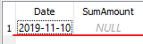

# Выборка данных

Кроме парадигмы SQL First `linq2db` так же стоит на парадигме соответствия `LINQ to objects` - это означает, что запрос, выполненный при помощи `linq2db` над базой данных будет таким же, как если бы вы выполняли обычный LINQ запрос над списком объектов. Иными словами, если вы знакомы с LINQ, то вы знакомы и с `linq2db`. Если же ваши знания в этой области хромают, то, советую уделить некоторое время изучению LINQ, начать можно со [101 LINQ Samples](https://www.google.com/search?sxsrf=ACYBGNQcEUF0O_bORfsj0bKyH7YT3MeiUQ%3A1581226571300&source=hp&ei=S5o_XrnkD-WRk74Pkve2gAc&q=101+linq+samples+microsoft&oq=101+linq&gs_l=psy-ab.3.1.0l6j0i22i10i30j0i22i30l3.1190.4423..5763...2.0..0.93.682.9......0....1..gws-wiz.......0i131j0i10j0i1j0i10i1.Qub5b46PTNQ).

В этой главе мы рассмотрим базовые LINQ запросы, способы их построения и некоторые особенности.

## Структура SQL запроса

Кроме всего прочего, SQL хорош ещё тем, что его практически однозначно можно перевести на любой нативный язык и обратно. Фактически, вы должны сформулировать какие данные вы хотите выбрать и едва ли не прямым текстам сказать это базе данных, и на нашу с вами радость создатели LINQ переняли эту особенность SQL, в результате чего мы имеем крайне простой, выразительный, а главное легко переводимый синтаксис с LINQ в SQL и наоборот. В данном разделе мы в первую голову будем рассматривать SQL запросы и как они выражаются на LINQ.

Для успешного построения запроса нам необходимо знать:

* что мы хотим получить;
* где эти данные лежат (в какой таблице);
* каким условиям они должны соответствовать;
* в каком порядке мы хотим получить данные.

Предположим, я хочу найти в нашей базе клиентов всех клиентов, которые были зарегистрированы до 01.01.2020 и вывести их в алфавитном порядке, или другими словами:

```code
Я ХОЧУ ВЫБРАТЬ Имя, Номер телефона
ИЗ ТАБЛИЦЫ Клиентов
У КОТОРЫХ Дата регистрации меньше 01.01.2020
И ОТСОРТИРОВАТЬ ПО Имени
```

Или на SQL:

```sql
SELECT FullName, Phone
FROM Customer
WHERE RegistrationTime < '2020-01-01'
ORDER BY FullName
```

Или на LINQ:

```cs
var time = new DateTime(2020, 1, 1);

var qry = from c in db.GetTable<Customer>()
where c.RegistrationTime < time
order by c.FullName
select c;

var data = qry.ToList();
```

Ну или на "колбасном" LINQ:

```cs
var time = new DateTime(2020, 1, 1);

var qry = db.GetTable<Customer>()
    .Where(c => c.RegistrationTime < time)
    .OrderBy(c => c.FullName);

var data = qry.ToList();
```

Как видите, все варианты легко читаются, а главное - пишутся.

## Сортировка по нескольким полям

Как мы и говорили ранее, везде есть некоторая специфика, SQL умеет сортировать по нескольким полям, LINQ - тоже умеет, но есть одна особенность при использовании "колбасного" синтаксиса:

```cs
var time = new DateTime(2020, 1, 1);

var qry = db.GetTable<Customer>()
    .Where(c => c.RegistrationTime < time)
    .OrderBy(c => c.FullName)
    .OrderBy(c => c.RegistrationTime);

var data = qry.ToList();
```

В результате такого запроса сортировка будет осуществлена **только** по полю `RegistrationTime`. По сути, можно считать, что не важно в каком порядке были записи до `OrderBy`, т.к. он упорядочит их в том порядке, в котором ему сказали. Для того, чтобы обойти эту проблему нужно использовать группу методов `ThenBy`:

```cs
var time = new DateTime(2020, 1, 1);

var qry = db.GetTable<Customer>()
    .Where(c => c.RegistrationTime < time)
    .OrderBy(c => c.FullName)
    .ThenBy(c => c.RegistrationTime);

var data = qry.ToList();
```

## Группировка

Особый "вид" запросов - сгруппированные. Предположим, нам необходимо посчитать, сколько же человек у нас регистрируется в день. Конечно, мы можем вытянуть весь список из базы, далее пробежаться по нему используя `foreach` и посчитать количество регистраций для каждого дня. Но, что произойдет, если нам нужно будет посчитать эту статистику за 10 лет? Очевидно, что объем данных может оказаться чрезмерным, что приведет к чудовищному времени выполнения этой операции и потреблению памяти, которая и вообще может закончиться, что приведет к падению нашего приложения. Тем не менее задача вполне типовая - построение итогового отчета по своей деятельности необходимо любым нашим заказчикам и SQL предоставляет такую возможность:

```sql
SELECT
    date(RegistrationTime) as Date,
    count(*) as RegistrationCount
FROM Customer
GROUP BY date(RegistrationTime)
```

В результате такого запроса будет возвращён кортеж из двух полей - даты регистрации и количества зарегистрированных людей (т.е. максимум 366 записей на год).

Рассмотрим и LINQ запрос:

```cs
var qry = from c in db.GetTable<Customer>()
group c by c.RegistrationTime.Date into gr
select new
{
    gr.Key.Date,
    RegistrationCount = gr.Count()
}

var data = qry.ToList();
```

**NB!**: всё что можно выразить LINQ синтаксисом, можно выразить и в "колбасном" синтаксисе, однако, в случае использования группировок и джоинов последний менее выразителен и сложнее читается. Ввиду чего лично я предпочитаю использовать "колбасный" синтаксис для простых запросов и LINQ-синтаксис для запросов с джоинами и группировками.

Сгруппированные запросы обладают одной особенностью - выбрать можно только те поля, по которым была выполнена группировка, так же в запросе можно использовать агрегатные функции: минимум, максимум, сумму, количество, среднее значение (`MIN`, `MAX`, `SUM`, `COUNT`, `AVG`). Что весьма логично, т.к. в каждой группе у нас может быть несколько записей, и нельзя однозначно определить, какое из несгруппированных и неагрегированных значений брать. Скажем, в нашем примере мы не можем выбрать имя клиента, т.к. не ясно какого конкретного посетителя взять из всей группы. LINQ очень хорошо выражает эту особенность - после операции группировки у нас получается объект, реализующий [IGrouping](https://docs.microsoft.com/ru-ru/dotnet/api/system.linq.igrouping-2?view=netcore-3.1), который:

* Имеет свойство `Key` - ключ, по которому выполняется группировка.
* Сам по себе представляет перечисление записей, относящихся к данной группе.

Группировать можно так же по нескольким полям. Допустим, мы захотим определить, есть ли у нас в таблице клиентов дубли - люди с совпадающим именем и телефоном:

```sql
SELECT
    FullName,
    Phone,
    count(*) as CopiesCount
FROM Customer
GROUP BY FullName, Phone
```

LINQ:

```cs
var qry = from c in db.GetTable<Customer>()
group c by new {c.FullName, c.Phone} into gr
select new
{
    gr.Key.FullName,
    gr.Key.Phone,
    RegistrationCount = gr.Count()
}

var data = qry.ToList();
```

Группировать можно так же несколько таблиц. Предположим, мы хотим узнать сумму накопленных бонусов у клиентов в зависимости от даты их регистрации:

```sql
SELECT
    date(c.RegistrationTime) as Date,
    SUM(bt.Amount) SumAmount,
    MIN(c.RegistrationTime) FirstRegistrationTime
FROM Customer c
INNER JOIN BonusTransaction bt on bt.CustomerId = c.Id
GROUP BY date(c.RegistrationTime)
```

В LINQ синтаксисе будет небольшая особенность:

```cs
var qry = from c in db.GetTable<Customer>()
join bt in db.GetTable<BonusTransaction>() on c.Id equals bt.CustomerId
group new {c, bt} by c.RegistrationTime.Date into gr
select new
{
    gr.Key.Date,
    SumAmount = gr.Sum(_ => _.bt.Amount),
    FirstRegistrationTime = gr.Min(_ => _.c.RegistrationTime)
}

var data = qry.ToList();
```

Обратите внимание, что в выражении `group` мы создаем анонимный объект из двух таблиц - посетителей и их транзакций.

### Агрегация над пустым кортежем

`NULL` занимает отдельное место в мире баз данных, и для агрегатов он тоже "постарался" - дело в том, что если агрегат будет выполнен над **пустой** группой, то его значением будет `NULL`. Рассмотрим пример:

```sql
SELECT
    date(c.RegistrationTime) as Date,
    SUM(bt.Amount) SumAmount
FROM Customer c
LEFT JOIN BonusTransaction bt on bt.CustomerId = c.Id
GROUP BY date(c.RegistrationTime)
```

В данном примере мы использовали утверждение `LEFT JOIN`, и оно кардинально изменило нам выходной запрос - теперь, если, допустим, у нас есть люди, зарегистрированные 01.01.2020, но у которых **нет** транзакций, мы все равно в выводном кортеже получим значение с данной датой регистрации и `NULL` в качестве суммы:



Ну и LINQ запрос:

```cs
var qry = from c in db.GetTable<Customer>()
from bt in db.GetTable<BonusTransaction>().LeftJoin(_ => c.Id == bt.CustomerId)
group new {c, bt} by c.RegistrationTime.Date into gr
select new
{
    gr.Key.Date,
    SumAmount = gr.Sum(_ => _.bt.Amount),
}

var data = qry.ToList();
```

С виду здесь нет никакого криминала, но на этапе материализации запроса мы получим исключение, о том, что `NULL` не может быть преобразован в `decimal`, вполне справедливо. К сожалению, типизация здесь играет с нами злую шутку, она не может "предвидеть" подобной оказии, и свойство `SumAmount` имеет тот же тип что и `BonusTransaction.Amount`, который **не может** принимать значение `NULL`.

Решение данной проблемы остается **на наших** плечах, благо дело оно тривиальное:

```cs
var qry = from c in db.GetTable<Customer>()
from bt in db.GetTable<BonusTransaction>().LeftJoin(_ => c.Id == bt.CustomerId)
group new {c, bt} by c.RegistrationTime.Date into gr
select new
{
    gr.Key.Date,
    SumAmount = gr.Sum(_ => (decimal?)_.bt.Amount),
}

var data = qry.ToList();
```

## Пейджинг

Рано или поздно, но нам придется сделать справочник всех наших покупателей, а ведь в списке их могут быть сотни и даже тысячи. Выводить все записи на единую форму - не оптимально по множеству причин: быстродействие, память, человеческий фактор, в некоторых условиях это может привести к падению приложения (допустим, веб браузер может просто не справится с отрисовкой тысяч записей). Но тем не менее люди "любят" справочники, а значит программистам приходится их делать, а значит и приходится как то бороться с проблемой избыточности данных. Типовое решение - пейджинг, т.е. постраничный вывод записей - данные представляются пользователям по 10-20 записей, с возможностью листать страницы. И, благо дело, большинство баз данных поддерживает такую возможность - а именно позволяют выбирать из общего кортежа N записей, и пропускать X записей.

Рассмотри пример - мы хотим выводить справочник покупателей по 10 записей на страницу, для этого нам необходимо:

* знать общее число записей;
* знать номер страницы, которую смотрит пользователь;
* сказать что бы база данных пропустила 10*[номер страницы - 1] записей и вернула нам 10 записей.

Перед тем, как разобрать пример отметим ещё одну особенность, которую нужно знать - по умолчанию БД вернет вам записи в **неопределенном** порядке - это означает, что БД не гарантирует того или иного порядка записей, в случае, если он не определен явно утверждением `ORDER BY`, поэтому для пейджинга **рекомендуется** явно указывать сортировку, что бы не возникло ситуации с "белыми пятнами", когда часть данных может быть не отображена пользователю из-за (бес)порядка.

Практически каждая БД реализует пейджинг по своему, на примере `SQLite` он выглядит следующим образом:

```sql
SELECT *
FROM Customer
ORDER BY Id
LIMIT 10, 100
```

Утверждение `LIMIT` позволяет указать сколько записей взять, а сколько пропустить.

LINQ:

```cs
var totalRecords = db.GetTable<Customer>().Count();

var page = db.GetTable<Customer>()
    .OrderBy(_ => _.Id)
    .Skip(100)
    .Take(10)
    .ToList();
```

В рассмотренном примере можно немного оптимизировать пейджинг, скажем, запомнив так же последний отображенный пользователю идентификатор покупателя, и выбрав для следующей страницы только те, записи, у которых он больше. Оставим вам это упражнение на самостоятельную работу.

**NB!:** Для корректной работы пейджинга необходимо использовать **сначала** метод `Skip`, а после него - `Take`!

## First & Single

Очень часто нам нужно получить из базы только одну запись, допустим, по её уникальному идентификатору. Для таких операций LINQ предоставляет группы методов:

* `First`, `FirstOrDefault` - возвращает первую запись удовлетворяющую условию выборки, `First` выкинет исключение если записей не будет, а `FirstOrDefault` вернет в этом случае значение по умолчанию для требуемого типа.
* `Single`, `SingleOrDefault` - аналогичен предыдущему методу, но проверяет так же что в источнике есть **только одна** запись, т.е. если будет две записи, `Single(OrDefault)` выкинет исключение.

Рассмотрим пример запроса с `First(OrDefault)`:

```cs
var customer = db.GetTable<Customer>().First(_ => _.Id = 101);
```

SQL:

```sql
SELECT *
FROM Customer
WHERE Id = 101
LIMIT 1
```

Ничего необычного, а теперь для `Single(OrDefault)`:

```cs
var customer = db.GetTable<Customer>().Single(_ => _.Id = 101);
```

SQL:

```sql
SELECT *
FROM Customer
WHERE Id = 101
LIMIT 2
```

Во втором случае `linq2db` учитывает особенность работы метода `Single`, предоставляя ему возможность убедится в том, что в исходных данных всего одна запись, удовлетворяющая условию, и для этого вывод кортежа ограничивается не одной записью как выше, а **двумя**.

## Далее

[Джоины](./joins.md).
