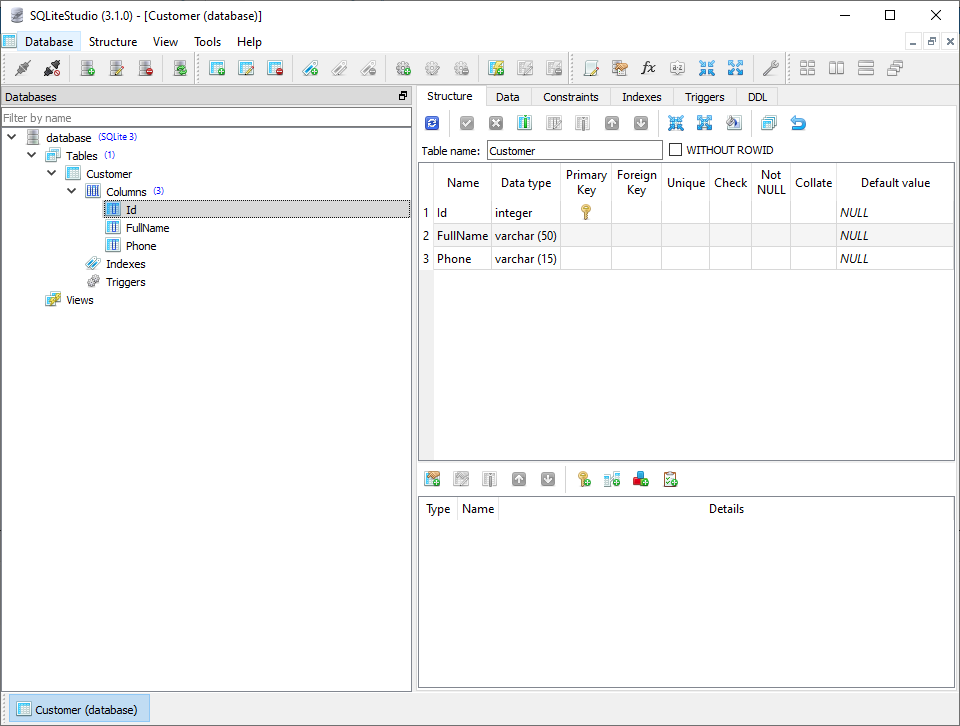
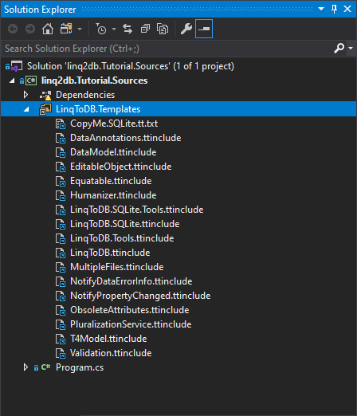

# Создание модели данных

В соответствии с подходом `SQL First` `linq2db` нацелена на минимально возможный уровень абстракции от БД. Как следствие модель данных становится максимально легковесной и повторяющей таблицы в БД. На небольших базах написать ее руками не составляет никаких проблем, в больших же проектах, где мы сталкиваемся с базами, состоящими из более чем сотни таблиц, подобный труд можно отнести к титаническим. Для минимизации труда и повышения надежности (как минимум защита от опечаток), `linq2db` поддерживает возможность генерации модели данных по метаданным базы.

Здась и далее мы будем использовать [SQLite](https://sqlite.org), прочие БД подключаются аналогичным образом.

Рекомендуемая последовательность работы:

1. Все изменения структур данных производятся непосредственно в базе, с использованием предоставляемого вендором или сообществом инструментария (в нашем случае [SQLiteStudio](https://sqlitestudio.pl))
2. После изменений в базе модель данных генерируется при помощи шаблонов T4.
3. Не рекомендуется автоматизировать генерацию при помощи CI сервисов или любым другим способом (это может вызывать коллизии при параллельной работе нескольких людей над одной базой)

Если коротко, то следствием `SQL First` будет `Database First`.

Теперь рассмотрим генерацию модели на практике:

1. Создайте новый проект в Visual Studio
2. Создайте новую БД с использованием SQLiteStudio, и добавьте в нее таблицу `Customers` с тремя полями:
   1. Id, integer, autoincrement, primary key
   2. FullName, varchar(50)
   3. Phone, varchar(15)<br/>
3. Установите пакет `linq2db.SQLite`
4. После установки в проекте появится папка `LinqToDB.Templates`:<br/>
5. Скопируйте содержимое файла `CopyMe.SQLite.tt.txt` в буфер обмена (для других БД имя файла будет `CopyMe.НазваниеБД.tt.txt`)
6. Создайте папку `Models` и в ней файл `Model.tt`. В случае появления сообщения о потенциальной опасности запуска генераторов текста поставьте галочку "Не показывать это сообщение в дальнейшем" и нажмите `OK`
7. Вставьте в `Model.tt` содержимое из `CopyMe.SQLite.tt.txt`
8. Укажите путь и имя файла БД в методе `LoadSQLiteMetadata(@"C:\Data", "MyDatabase.sqlite")`
9. Сохраните файл шаблона (Visual Studio запускает генерацию Т4 шаблонов в момент их сохранения). В папке появится новый файл `Model.generated.cs`

## Модель данных

Сгенерированная модель содержит класс наследник [DataConnection](https://linq2db.github.io/api/LinqToDB.Data.DataConnection.html), и по одному классу на каждую таблицу в базе данных:

```cs
public partial class DatabaseDB : LinqToDB.Data.DataConnection
{
    public ITable<Customer> Customers { get { return this.GetTable<Customer>(); } }

    public DatabaseDB()
    {
        InitDataContext();
        InitMappingSchema();
    }

    public DatabaseDB(string configuration)
        : base(configuration)
    {
        InitDataContext();
        InitMappingSchema();
    }

    partial void InitDataContext  ();
    partial void InitMappingSchema();
}

[Table("Customer")]
public partial class Customer : IId
{
    [PrimaryKey, Identity] public long   Id       { get; set; } // integer
    [Column,     Nullable] public string FullName { get; set; } // varchar(50)
    [Column,     Nullable] public string Phone    { get; set; } // varchar(15)
}

```

Все сгенерированные типы по умолчанию `partial` как следствие их можно дополнять собственным кодом по необходимости.

В общем случае будут сгенерированы:

* POCO для каждой таблицы
* POCO для каждого представления
* Методы для вызова хранимых процедур
* Методы для вызова функций
* Методы расширения для выборки данных по первичному ключу

## Порядок генерации

Генерация модели происходит в несколько этапов, рассмотрим их на примере текущего шаблона:

```cs
<#@ template language="C#" debug="True" hostSpecific="True"                        #>
<#@ output extension=".generated.cs"                                               #>
<#@ include file="$(LinqToDBT4SQLiteTemplatesDirectory)LinqToDB.SQLite.Tools.ttinclude" #>
<#@ include file="$(LinqToDBT4SQLiteTemplatesDirectory)PluralizationService.ttinclude"  #>
<# //@ include file="$(ProjectDir)LinqToDB.Templates\LinqToDB.SQLite.Tools.ttinclude" #>
<# //@ include file="$(ProjectDir)LinqToDB.Templates\PluralizationService.ttinclude"  #>
<#

    // 1. Настройки генерации
    NamespaceName = "DataModels";

    // 2. Загрузка метаданных из БД
    // На этом этапе из БД вычитывается информация о:
    //   * Таблицах и их колонках
    //   * Отношениях между таблицами (внешние ключи)
    //   * Представлениях и их колонках
    //   * Хранимых процедурах и функциях
    LoadSQLiteMetadata(@"C:\Data", "MyDatabase.sqlite");
//    LoadSQLiteMetadata(string connectionString);

    // 3. кастомизация модели
    // В данном шаблоне этот шаг отсутствует
    // более детально мы разберем его в разделе
    // с описанием дополнительных возможностей шаблонов Т4

    // 4. Собственно генерация модели
    GenerateModel();
#>

```

## Настройка генерации

Ниже мы рассмотрим основные параметры, позволяющие кастомизировать сгенерированный код, более подробное описание можно найти [здесь](https://linq2db.github.io/articles/T4.html).

```cs
// Неймспейс, для сгенерированной модели
NamespaceName                  = "DataModels";

/* Настройки для класса соединения */
// (string) Имя базового класса для соединения
// По умолчанию: LinqToDB.Data.DataConnection.
BaseDataContextClass           = null;
// (string) Имя класса соединения.
// По умолчанию: <Имя базы данных> + "DB"
DataContextName                = null;

/* Настройки генерации классов таблиц (POCO) */
// (string) Название базового класса для классов таблиц
// Так же можно через запятую указать реализуемые интерфейсы
BaseEntityClass               = null;
// Данная настройка позволяет включить или отключить генерацию классов для представлений
GenerateViews                 = true;

/* Настройки для генерации связей */
/* Для генерации используются данные о внешних ключах таблиц */
// Шаблон для типа связи один ко многим
// Возможные варианты: "{0}[]", "List<{0}>".
OneToManyAssociationType      = "IEnumerable<{0}>";
// Позволяет включить или отключить генерацию полей для связей
GenerateAssociations          = true;
// Позволяет включить или отключить генерацию полей для обратных ссылок
// т.е. генерировать поля с типом "родителя" в подчиненных таблицах
GenerateBackReferences        = true;
// Позволяет генерировать связи не как члены классов таблиц, а как методы-расширения
GenerateAssociationExtensions = false;

/* Дополнительный функционал */
// Позволяет включить или отключить генерацию методов расширений для поиска по первичному ключу
GenerateFindExtensions        = true;

```

## Использование настроек

Настройки задаются в T4 шаблоне до вызова метода `GenerateModel()`. Давайте настроим наш шаблон следующим образом:

1. Неймспейс "LinqToDB.Tutorial.Models"
2. Имя класса соединения: "TutorialDataConnection"
3. Так же добавим интерфейс `IId`, и сделаем так, что бы его реализовывали все наши POCO

Код шаблона:

```cs
<#@ template language="C#" debug="True" hostSpecific="True"                        #>
<#@ output extension=".generated.cs"                                               #>
<#@ include file="$(LinqToDBT4SQLiteTemplatesDirectory)LinqToDB.SQLite.Tools.ttinclude" #>
<#@ include file="$(LinqToDBT4SQLiteTemplatesDirectory)PluralizationService.ttinclude"  #>
<#

    NamespaceName   = "LinqToDB.Tutorial.Models";
    DataContextName = "TutorialDataConnection";
    BaseEntityClass = "IId";

    LoadSQLiteMetadata(this.Host.ResolvePath(@"..\..\DB\"), "database.sqlite");

    GenerateModel();
#>
```

Сгенерированная модель будет следующей:

```cs
#pragma warning disable 1591

using System;
using System.Linq;

using LinqToDB;
using LinqToDB.Mapping;

namespace LinqToDB.Tutorial.Models
{
    /// <summary>
    /// Database       : database
    /// Data Source    : database
    /// Server Version : 3.19.3
    /// </summary>
    public partial class TutorialDataConnection : LinqToDB.Data.DataConnection
    {
        public ITable<Customer> Customers { get { return this.GetTable<Customer>(); } }

        public TutorialDataConnection()
        {
            InitDataContext();
            InitMappingSchema();
        }

        public TutorialDataConnection(string configuration)
            : base(configuration)
        {
            InitDataContext();
            InitMappingSchema();
        }

        partial void InitDataContext  ();
        partial void InitMappingSchema();
    }

    [Table("Customer")]
    public partial class Customer : IId
    {
        [PrimaryKey, Identity] public long   Id       { get; set; } // integer
        [Column,     Nullable] public string FullName { get; set; } // varchar(50)
        [Column,     Nullable] public string Phone    { get; set; } // varchar(15)
    }

    public static partial class TableExtensions
    {
        public static Customer Find(this ITable<Customer> table, long Id)
        {
            return table.FirstOrDefault(t =>
                t.Id == Id);
        }
    }
}

#pragma warning restore 1591
```

## Исходный код к разделу

[Доступен здесь](https://github.com/linq2db/tutorial.sources/tree/create_model), ветка `create_model`

## Далее

[Маппинг](mapping.md)
